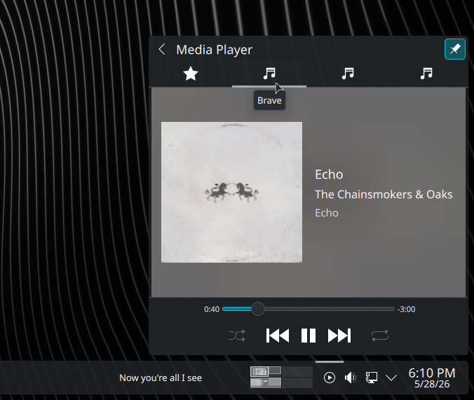
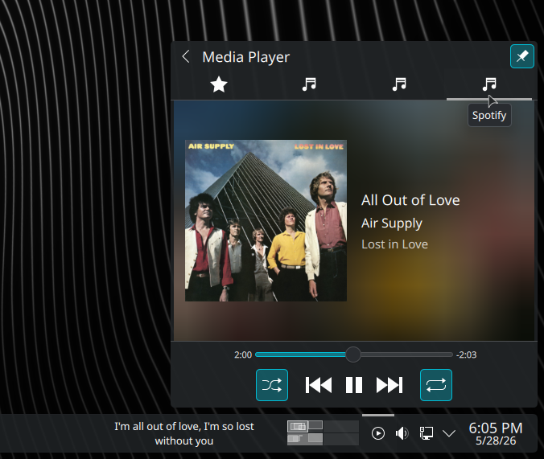
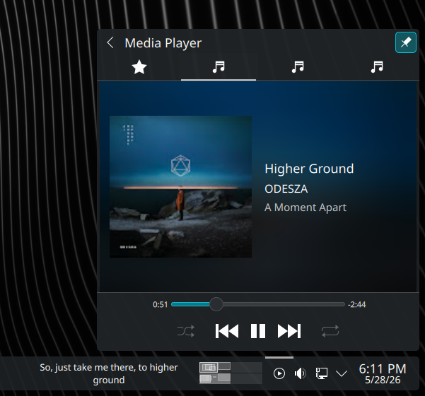
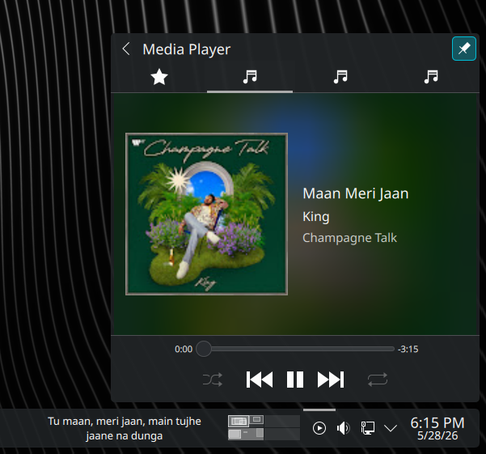
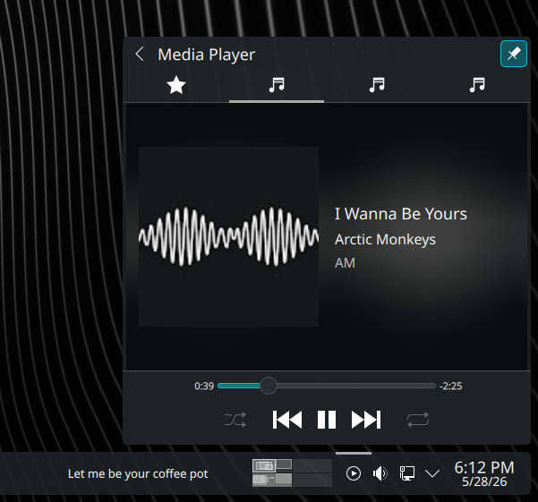

# LyricTicker for KDE

A lightweight KDE Plasma 6 widget that displays real-time synced lyrics for your currently playing track — right on your desktop panel.


---

## Features

- 🎵 Real-time synced lyrics with millisecond accuracy
- 🎨 Lives in your KDE Plasma panel as a widget
- 🔍 Automatic track detection via MPRIS2/D-Bus
- 🌐 Multiple lyrics sources (LRCLib, more coming soon)
- ⚡ Lightweight async Python backend









## Supported Media Players

| Player | Status |
|--------|--------|
| Spotify | ✅ Working |
| Fooyin | ✅ Working |
| VLC | ✅ Working |
| YouTube (Browser) | ⚠️ In progress |
| YouTube Music (Browser) | ✅ Working |
| Any MPRIS2-compatible player | ✅ Should work |

## How It Works

```
Media Player (MPRIS2/D-Bus)
        ↓
Python Backend (track detection + lyrics fetch)
        ↓
Local HTTP Server (127.0.0.1:5000)
        ↓
KDE Plasma Widget (displays lyrics)
```

The Python backend detects your currently playing track via D-Bus, fetches synced lyrics from LRCLib, and serves the current lyric line to the plasmoid over a local HTTP server.

---

## Requirements

- KDE Plasma 6.6+
- Python 3.11+
- The following Python packages:
  - `PySide6`
  - `aiohttp`
  - `dbus-next`
  - `qasync`

---

## Installation

### 1. Clone the repository

```bash
git clone https://github.com/https-rahul/LyricTicker-for-KDE.git
cd LyricTicker-for-KDE
```

### 2. Install Python dependencies

```bash
pip install PySide6 aiohttp dbus-next qasync
```

### 3. Run the install script

```bash
chmod +x scripts/install.sh
./scripts/install.sh
```

This will:
- Install the plasmoid to `~/.local/share/plasma/plasmoids/`
- Install a systemd user service for the backend
- Reload the Plasma shell

### 4. Add the widget to your panel

1. Right-click your Plasma panel
2. Click **"Add Widgets"**
3. Search for **"Lyric Ticker"**
4. Drag it to your panel

### 5. Start the backend service

```bash
systemctl --user enable lyricticker
systemctl --user start lyricticker
```

The backend will now start automatically on every login.

---

## Manual Usage (without systemd)

If you prefer to run the backend manually:

```bash
cd LyricTicker-for-KDE
python backend/main.py
```

---

## Uninstall

```bash
chmod +x scripts/uninstall.sh
./scripts/uninstall.sh
```

---

## Development

### Project Structure

```
LyricTicker-for-KDE/
├── backend/                  # Python backend
│   ├── lyrics/               # Lyrics source providers
│   │   ├── base.py           # Abstract base class
│   │   ├── manager.py        # Source priority manager
│   │   └── lrclib.py         # LRCLib provider
│   ├── constants.py          # Config (port, host, paths)
│   ├── models.py             # TrackData dataclass
│   ├── mpris_service.py      # D-Bus/MPRIS2 track detection
│   ├── lyrics_provider.py    # Qt bridge + sync logic
│   └── main.py               # Entry point
├── plasmoid/                 # KDE Plasma widget
│   ├── contents/ui/
│   │   └── main.qml          # Widget UI
│   └── metadata.json
├── dev/
│   └── AppWindow.qml         # Debug window (dev only)
├── scripts/
│   ├── install.sh
│   └── uninstall.sh
└── docs/
    └── architecture.md
```

### Running in dev mode

```bash
LYRICTICKER_DEV=1 python backend/main.py
```

Dev mode launches the debug window (`AppWindow.qml`) alongside the backend, showing previous/current/next lyric lines in real time.

### Branching strategy

```
master        ← stable releases only
└── dev       ← active development
    └── fix/* or feature/*  ← individual changes
```

All changes go through PRs into `dev`. `dev` merges into `master` for releases only.

---

## Adding a Lyrics Source

1. Create `backend/lyrics/yoursource.py` implementing `BaseLyricsProvider`
2. Add it to the source list in `backend/lyrics/manager.py`
3. That's it — no other files need changing

```python
# backend/lyrics/yoursource.py
from backend.lyrics.base import BaseLyricsProvider
from backend.models import TrackData

class YourSourceProvider(BaseLyricsProvider):

    @property
    def name(self) -> str:
        return "YourSource"

    async def fetch_lyrics(self, track: TrackData) -> str | None:
        # fetch and return LRC formatted synced lyrics
        # return None if not found
        ...
```

---

## Planned Features

- [ ] NetEase Cloud Music lyrics source
- [ ] QQ Music lyrics source
- [ ] Kugou lyrics source
- [ ] Plasmoid configuration dialog (font size, colour, source priority)
- [ ] YouTube from browser support
- [ ] Windows support via SMTC API

---

## License

GPL-3.0 — see [LICENSE](LICENSE) for details.

---

## Acknowledgements

- [LRCLib](https://lrclib.net) — open lyrics API
- [MPRIS2 specification](https://specifications.freedesktop.org/mpris-spec/latest/) — media player D-Bus interface
- [Fooyin](https://github.com/ludouzi/fooyin) — inspiration for multi-source lyrics architecture
